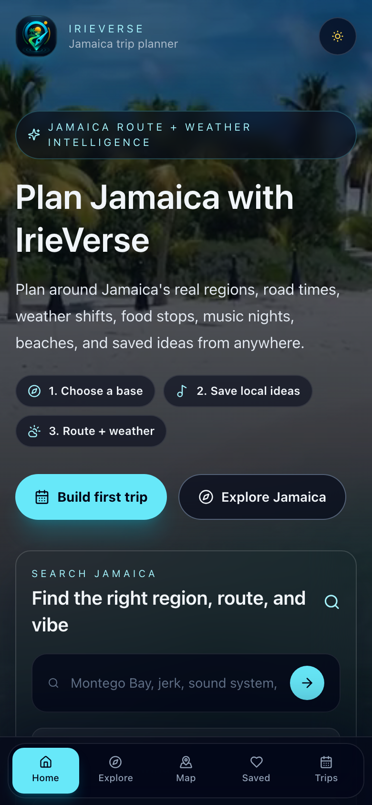
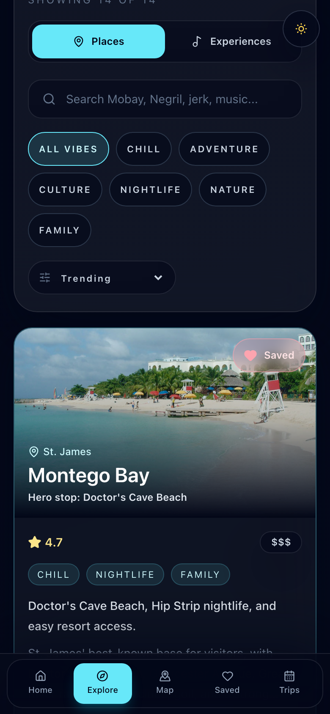
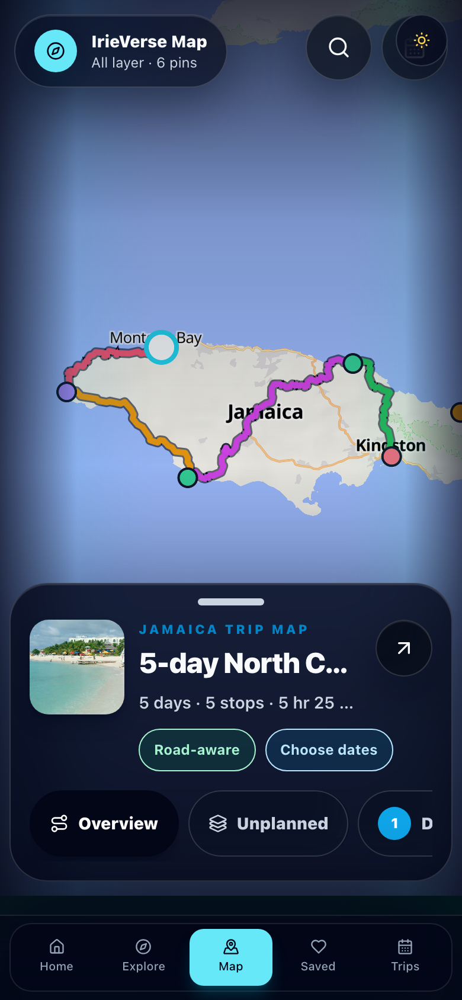
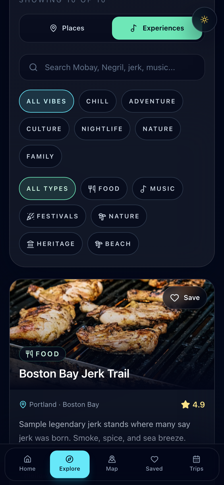
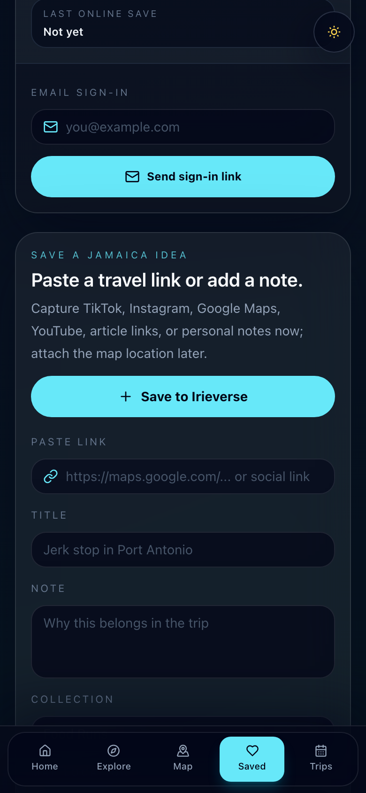
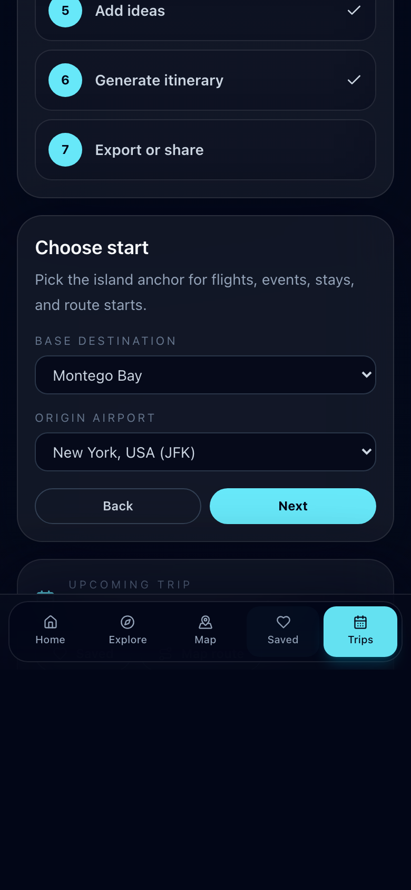
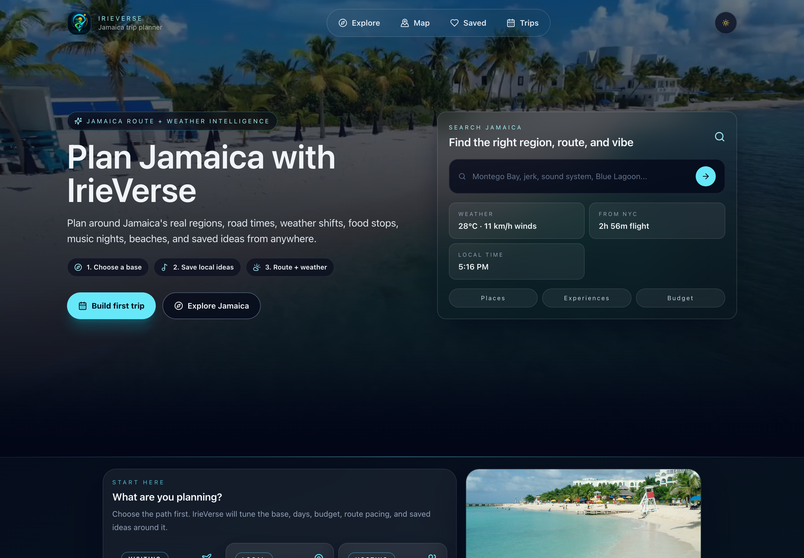
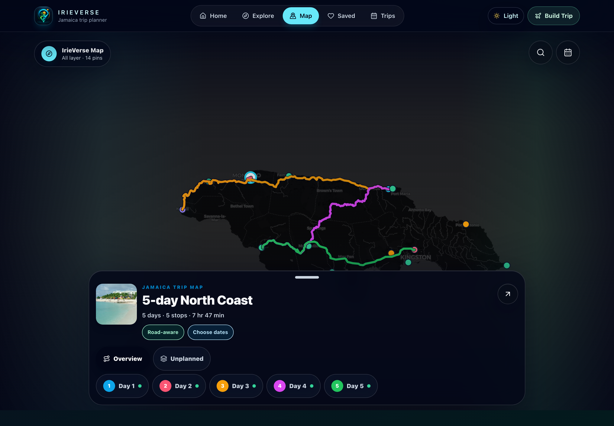

# IrieVerse Travel OS
An interactive Jamaica trip planner built with React + Vite. Explore destinations and experiences, view maps, live events, flight snapshots, budgeting, and export/share itineraries.

## Features
- Destination + experience explorer with vibe filters and search
- Interactive map powered by MapLibre with road-following route overlays
- Jamaica-specific road pacing, weather cues, and local food/music/beach/culture content
- Saved boards with automatic Google Maps, TikTok, Instagram, YouTube, and article link parsing
- PWA share target for sending external travel links into the Saved import flow
- Region-aware trip planner with editable route order, route pacing, drive estimates, budget, dates, and ICS export
- Trip planning confidence panel for share links, stays, flights, road routes, and events
- Flight snapshot with live schedules or saved examples
- Island calendar and stay recommendations with live data or curated examples
- Optional Supabase-backed trip sharing
- Production QA deletes its own Supabase test share rows after verification
- PWA manifest, install icons, app shortcuts, and same-origin offline cache for fallback data/assets

## Quick start
1) Install Node 18+  
2) Install deps: `npm install`  
3) Run dev server: `npm run dev`  
4) Build for prod: `npm run build`

## Environment (optional)
Copy `.env.example` to `.env.local` and fill any of the following:

```
VITE_SUPABASE_URL=your_supabase_url           # enables trip sharing
VITE_SUPABASE_ANON_KEY=your_supabase_anon_key # enables trip sharing
AVIATIONSTACK_API_KEY=your_key                # server-only live flights through /api/flights
AVIATIONSTACK_DISABLED=false                  # set true locally to force saved examples
AVIATIONSTACK_CACHE_TTL_SECONDS=900           # cache live flight lookups for 15 minutes
AVIATIONSTACK_COOLDOWN_SECONDS=1800           # pause provider calls for 30 minutes after rate limits
VITE_FLIGHTS_API_URL=/api/flights             # optional flight proxy override
VITE_BOOKING_API_URL=/api/bookings            # live bookings through the Vercel Amadeus proxy
AMADEUS_CLIENT_ID=your_amadeus_api_key        # server-only; do not prefix with VITE_
AMADEUS_CLIENT_SECRET=your_amadeus_api_secret # server-only; do not prefix with VITE_
ROUTING_API_BASE_URL=https://router.project-osrm.org # server-only road routing proxy
```

If env vars are absent, the app falls back to local sample data in `public/data`.
See `docs/production-env.md` for production platform setup, booking API response shape, and Supabase migration details.

## Deployment
- Vercel: Import the repo, Framework = Vite, Build Command = `npm run build`, Output = `dist`, add env vars as needed.
- The booking integration uses the Vercel serverless route at `/api/bookings`.
- The flight integration uses the Vercel serverless route at `/api/flights` so AviationStack secrets stay server-only. The proxy caches live lookups and cools down after provider rate limits.
- The import flow uses `/api/import-metadata` for Open Graph and YouTube metadata, then falls back to local link heuristics when platforms block metadata.
- The map driving overlay uses the serverless route at `/api/road-route` for road geometry and maneuver previews.
- The Trips screen shows planning confidence so production QA can verify what is live, estimated, or curated.
- PWA shortcuts open app tabs directly with `?tab=explore`, `?tab=map`, and `?tab=trips`.
- Installed PWA share actions open `?tab=saved` with shared title/text/url prefilled and categorized for import.
- Plain static hosting: run `npm run build` and serve the `dist` folder (e.g., `npx serve dist`).

## Launch checks
- `npx tsc --noEmit`
- `npm run build`
- `npm run qa:production`
- `npm audit --omit=dev --audit-level=high`

Current audit note: npm reports a moderate MapLibre transitive advisory through `pbf`/`protocol-buffers-schema` with no available fix. High-severity production audit currently passes.

## Screenshots
Generated by the Playwright QA flow against the current app build.

| Home | Explore | Map |
| --- | --- | --- |
|  |  |  |

| Experiences | Saved import | Trips |
| --- | --- | --- |
|  |  |  |

Desktop home:



Desktop map:



## Marketing kit
- Strategy: `docs/marketing-strategy.md`
- Local mode plan: `docs/local-mode-plan.md`
- Static press kit page: `public/press-kit.html`
- Production press kit URL after deploy: `https://irieverse.vercel.app/press-kit.html`

The marketing kit uses the QA-generated screenshots above, so launch visuals stay aligned with the current production app.

## Tech stack
React 18, Vite, TypeScript, Tailwind CSS, MapLibre via `react-map-gl`, Supabase (optional for collab).
